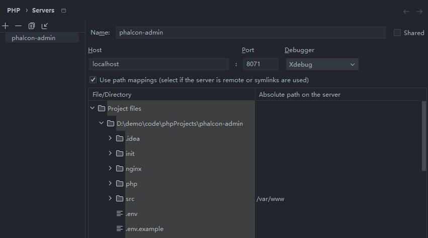
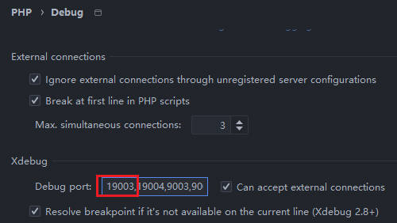
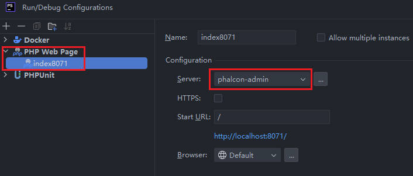
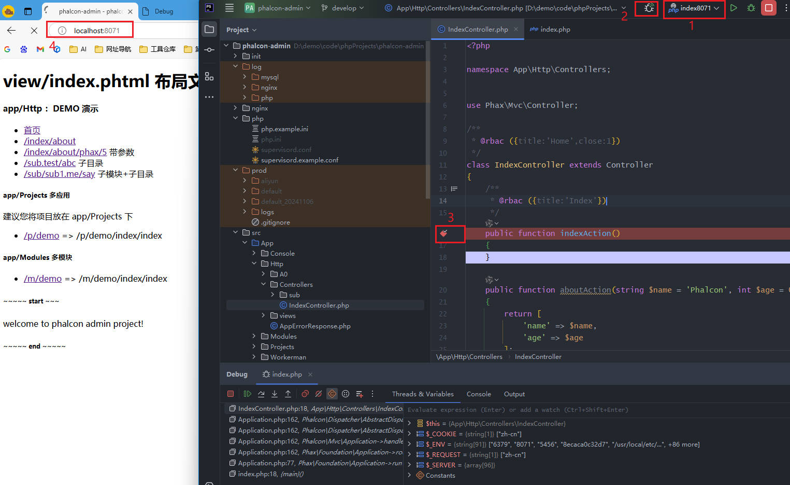

make sure you have setting in [PHPStorm Docker](zh-cn/phpstorm.md)

### Xdebug in Docker


默认配置已经在 `php/php.example.ini` 中存在，不建议直接修改 `php.example.ini` 文件，可以复制一份修改名称为 `php.ini`（注意修改 `docker-compose.yaml` 中 php service 对应的配置）

```ini
; open the xdebug setting in php/php.ini
zend_extension=xdebug.so
[xdebug]
xdebug.mode = debug,develop
xdebug.discover_client_host = 0
xdebug.idekey = docker
xdebug.start_with_request = yes
xdebug.client_port = 19003
xdebug.client_host = host.docker.internal

; 注意，无特殊需求，不需要开启下面 xdebug.log，否则会打印很多额外的信息
; 不方便阅读，而且会导致测试失败
;xdebug.log = /dev/stdout
;xdebug.log = /var/log/php/xdebug.log
```

don't use `9003` if you has install `xdebug` in your local PC.

修改 `docker-compose.yaml` 中 `php` 服务的配置

```
services:
  php:
    container_name: ${APP_NAME}-php
    image: authus/phalcon:5.8.0-s4
    #image: registry.cn-shenzhen.aliyuncs.com/authus/phalcon:5.8.0-s4
    working_dir: /var/www
    volumes:
      - ./src:/var/www:delegated
      - ./log/php:/var/log/php/:rw
      ;- ./php/php.example.ini:/usr/local/etc/php/php.ini  # <-------- 修改为下面的 php.ini
      - ./php/php.ini:/usr/local/etc/php/php.ini
    networks:
      - backend
    extra_hosts:
      - host.docker.internal:host-gateway
    environment:
      PHP_IDE_CONFIG: "serverName=phalcon-admin"
    env_file:
      - .env 
```

now remember the `xdebug.client_port` is `19003`, `xdebug.idekey` is `docker`, the `serverName` is `phalcon-admin`,
we will use the port and serverName in PHPStorm setting.

### PHPStorm Setting

* PHP > Debug > DBGp Proxy

```
IDE key: docker             ; form the xdebug.idekey
Host   : localhost
Port   : 8071               ; form the .env OPEN_PORT
```

* PHP > Servers

create a new server with `phalcon-admin` (must eq with `serverName`)，配置如下

```
Host    : localhost
Port    : 8071
Debugger: Xdebug

[checked]Use path mappings...

File/Director       Absolute path on the server
...
    >src             /var/www
```



* PHP > Debug

add the `xdebug.client_port` value `19003` to the Debug port.



* Run/Debug Configuration

添加运行配置，类型为 `PHP Web Page`, 服务选择 `phalcon-admin`，我们将其命名为 `index8071`



### Test Result

1. 选择刚刚创建的 `index8071`
2. 打开连接监听开关
3. 在待访问页面打上断点（示例为 `src/App/Http/Controllers/IndexController.php`，即默认首页）
4. 在浏览器中访问默认的首页 `http://localhost:8071`



如果配置成功，那么我们就可以在 IDE Debug 区域看到调试结果


### 常见问题


* `9003` is busy，`Server name` 显示为空，`port` 总是 80

移除 xdebug 配置中的 9003，可能被本地 php 环境占用了

* 点击 debug 后自动打开链接 `http://localhost:8071` 但是断点没有中断

IDE 配置 `PHP > Servers` 中的 `Name`与 `docker-compose.yaml` 中 php 服务的 `serverName` 不一致

* xdebug 正常调试，但 Action 内部的断点又被忽略

不知道具体原因，直接删除项目下的 `.idea` 目录，然后重新打开，再配置，可恢复正常。