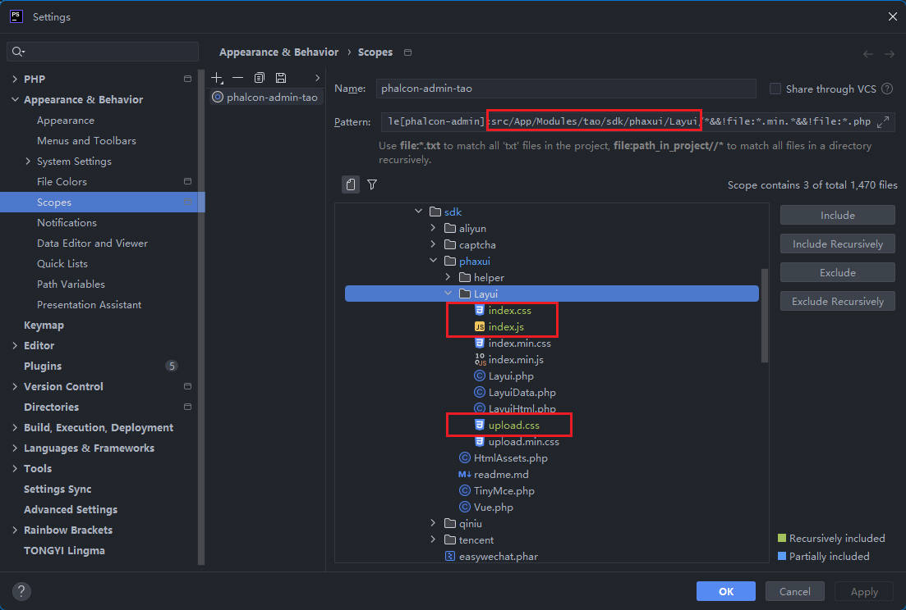
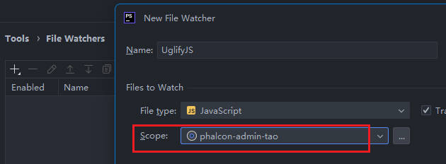
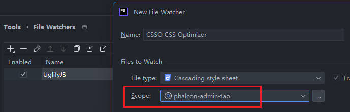

## css/js 压缩

如果需要对项目的 css 和 js 进行压缩处理，则需要安装以下插件。

* [Minifying Js](https://www.jetbrains.com/help/phpstorm/minifying-javascript.html#ws_js_minify_example_uglifyJS)
* [Minifying Css](https://www.jetbrains.com/help/phpstorm/compressing-css.html#css_before_you_start)

#### Appearance & Behavior | Scopes

创建一个新的 `Scopes`，我们将其名称设置为 `phalcon-admin-tao`，`Pattern` 内容为 `file[phalcon-admin]:src/App/Modules/tao/sdk/phaxui/Layui/*&&!file:*.min.*&&!file:*.php`

为了避免出现 `min.min`，我们在后面添加上 `&&!file:*.min.*&&!file:*.php`

#### Tools | File Watchers

* 添加一个 `UglifyJS` 用于 js 压缩

* 添加一个 `CSSO CSS Optimizer` 用于 css 压缩

