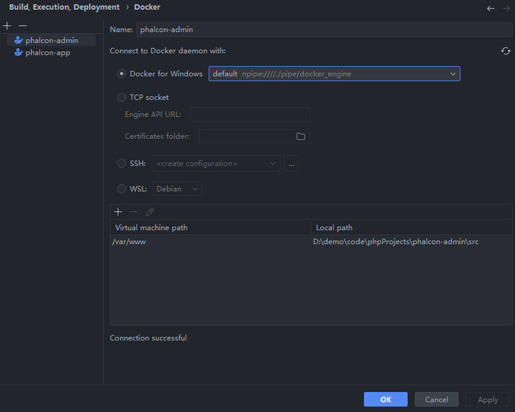
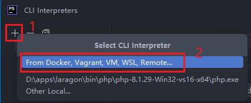
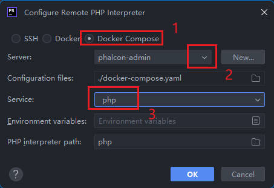
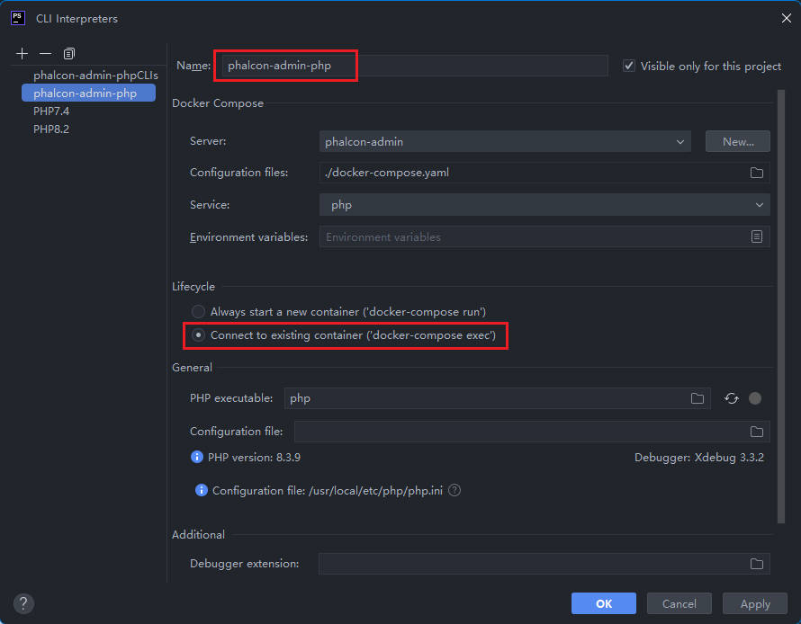

我们的项目运行在 `docker` 环境中，IDE 使用的是 `PHPStorm`，为了方便开发和测试，需要在 `PHPStorm` 进行一些配置

#### 准备

确保 `PHPStorm` 开启了以下插件

* PHP Remote Interpreter
* PHP Docker
* FTP/SFTP/WebDAV Connectivity
* Docker

#### Build,Execution,Deployment > Docker

add a new `docker` setting

```
Name                : phalcon-admin ; whatever you like
Docker for Windows  : default ... docker_engine

Virtual machine path            Local path
/var/www                        /xxx/xxx/YourProjectName/src
```




#### PHP

now we will create a new CLI

1. click the `...` on the right of the `CLI Interpreter` in the PHP view.

Select `From Docker, Vagrant, VM, WSL, Remote...` Option in the `Select CLI Interpreter` Dialog.

如果你没有看到这一选项，请检查是否安装/开启了需要的插件



2. Configure Remote PHP Interprter

```
[selected]Docker Compose
Server  : phalcon-admin
Service : php
```



Click the `OK` button

3. modify name

change the default name `php` to a new name, here we use `phalcon-admin-php` for example.



基本配置已经完成，现在我们可以准备配置 `Debug` 和 `PHPUnit` 了