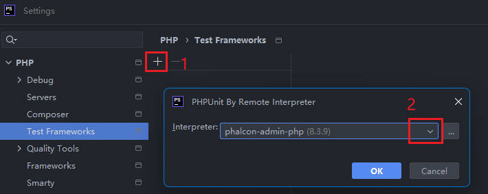
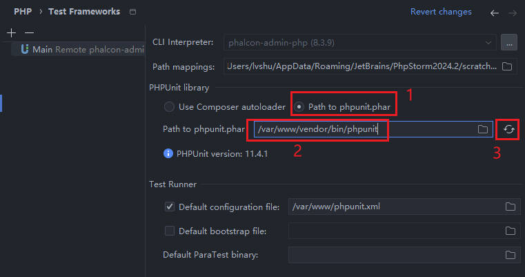
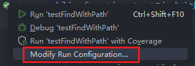
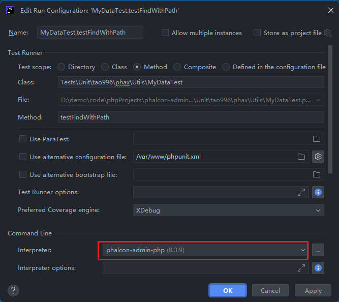
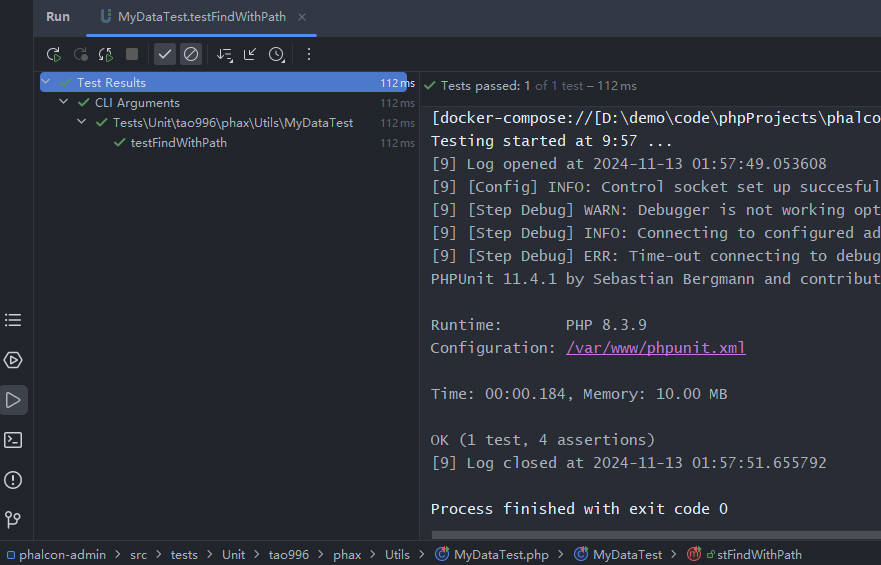

make sure you have setting in [PHPStorm Docker](zh-cn/phpstorm.md)

* 安装好相关的插件
* 添加了 PHP CLI

进入服务控制台，执行 `composer.phar install` 安装以下开发组件

```
# 进入 php 服务控制台；如果使用 Docker Desktop，则直接点击服务进入即可
docker-compose exec php sh // 也可能是 docker compose 取决于你的系统

# /var/www/composer.json 中依赖内容
"require-dev": {
    "php": "^8.3",
    "phpunit/phpunit": "^11.2",
    "mockery/mockery": "^1.6"
}
```

打开 PHPStorm Setting, 进入 `PHP > Test Frameworks`

1. add a new Test Frameworks with `PHPUnit By Remote Interpreter`



2. Setting

注意：你需要安装好 `require-dev`，填写路径 `/var/www/vendor/bin/phpunit`



### Test Result

选择任意一个测试文件，如 `src/tests/Unit/tao996/phax/Utils/MyDataTest.php`，在 IDE上点击执行，查看效果

1. 点击待测试方法左边的绿色图标，从弹出的窗口中选择 `Modify Run Configuration`



2. 在 `Command Line > Interpreter` 中选择之前创建的 CLI



3. 查看测试结果

